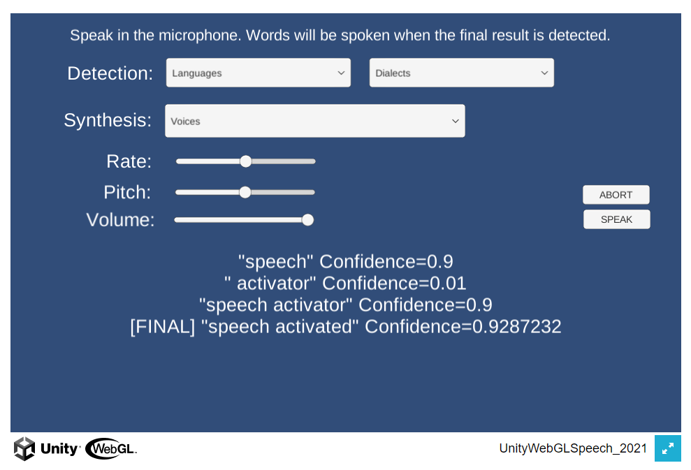
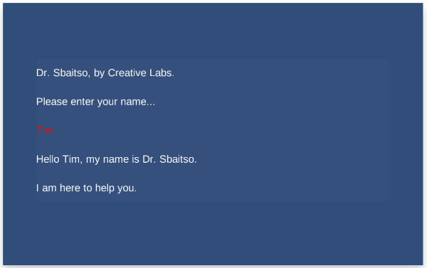

# UnityWebGLSpeech
The `WebGL Speech` package combines speech detection and speech synthesis.

The `WebGL Speech` package is available in the [Unity Asset Store](https://assetstore.unity.com/packages/tools/audio/webgl-speech-105831).
[Online documentation](https://github.com/tgraupmann/UnityWebGLSpeech) is available.

# See Also

The `WebGL for Speech Detection` package is available in the [Unity Asset Store](https://www.assetstore.unity3d.com/en/#!/content/81076). [Online documentation](https://github.com/tgraupmann/UnityWebGLSpeechDetection) is available.

The `WebGL for Speech Synthesis` package is available in the [Unity Asset Store](https://www.assetstore.unity3d.com/en/#!/content/81861). [Online documentation](https://github.com/tgraupmann/UnityWebGLSpeechSynthesis) is available.

# Supported Platforms

* WebGL

* Mac Standalone (using [Speech Proxy](https://github.com/tgraupmann/ConsoleChromeSpeechProxy))

* Mac Unity Editor (using [Speech Proxy](https://github.com/tgraupmann/ConsoleChromeSpeechProxy))

* Windows Standalone (using [Speech Proxy](https://github.com/tgraupmann/ConsoleChromeSpeechProxy))

* Windows Unity Editor (using [Speech Proxy](https://github.com/tgraupmann/ConsoleChromeSpeechProxy))

# Target

The `Unity WebGL Speech Package` is created for Unity version `5.3` or better. This includes support for Unity 2017.X, 2018.X, and 2019.X.
This package combines the `Unity WebGL Speech Detection` and `Unity WebGL Speech Synthesis ` packages.
This package was originally created for the `WebGL` platform and supports other platforms using a `Speech Proxy`.
This package requires a browser with the built-in [Web Speech API](https://dvcs.w3.org/hg/speech-api/raw-file/tip/speechapi.html), like Chrome.
Speech detection and synthesis requires an Internet connection.
The [browser compatibility](https://developer.mozilla.org/en-US/docs/Web/API/Web_Speech_API#Browser_compatibility) indicates which browsers have the `Speech API` implemented.
The [languages page](https://cloud.google.com/speech/docs/languages) shows what languages are supported by the `Speech API`.

# Changelog

1.0 Initial creation of package

1.1 - Added support for `Speech Proxy`

1.2 - Minor fixes

1.3 - Added support for speech detection/synthesis in edit mode

1.4 - Added support for `MacOS` for `play-mode` and `edit-mode`

1.5 - Added example without GUI

1.6 - Added buffering for language data

1.7 - Cleaned up sample code

1.8 - Updated sample scenes to use default 5000 port

1.9 - Added support for 2018.1 and 2019.1.

# Scenes

## Example01 - Dictation Synthesis

The scene is located at `Assets/WebGLSpeech/Scenes/Example01_Dictation_Synthesis.unity`.

The example source is located at `Assets/WebGLSpeech/Scripts/Example01DictationSynthesis.cs`.

The [example demo](https://theylovegames.com/UnityWebGLSpeech_01DictationSynthesis/) is available online.

## Example02 - Dictation Sbaitso

The scene is located at `Assets/WebGLSpeech/Scenes/Example02_Dictation_Sbaitso.unity`.

The example source is located at `Assets/WebGLSpeech/Scripts/Example02DictationSbaitso.cs`.

The [example demo](https://theylovegames.com/UnityWebGLSpeech_02DictationSbaitso) is available online.

