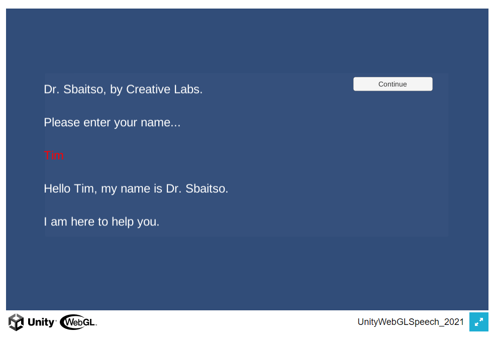

# UnityWebGLSpeech

The `WebGL Speech` package combines speech detection and speech synthesis.

The `WebGL Speech` package is available in the [Unity Asset Store](https://assetstore.unity.com/packages/tools/audio/webgl-speech-105831).
[Online documentation](https://github.com/tgraupmann/UnityWebGLSpeech) is available.

## See Also

The `WebGL for Speech Detection` package is available in the [Unity Asset Store](https://www.assetstore.unity3d.com/en/#!/content/81076). [Online documentation](https://github.com/tgraupmann/UnityWebGLSpeechDetection) is available.

The `WebGL for Speech Synthesis` package is available in the [Unity Asset Store](https://www.assetstore.unity3d.com/en/#!/content/81861). [Online documentation](https://github.com/tgraupmann/UnityWebGLSpeechSynthesis) is available.

## Supported Platforms

* WebGL

* Mac Standalone (using [Speech Proxy](https://github.com/tgraupmann/ConsoleChromeSpeechProxy))

* Mac Unity Editor (using [Speech Proxy](https://github.com/tgraupmann/ConsoleChromeSpeechProxy))

* Windows Standalone (using [Speech Proxy](https://github.com/tgraupmann/ConsoleChromeSpeechProxy))

* Windows Unity Editor (using [Speech Proxy](https://github.com/tgraupmann/ConsoleChromeSpeechProxy))

## Target

The `Unity WebGL Speech Package` is created for Unity version `5.3` or better. This includes support for Unity 2017.X, 2018.X, and 2019.X.
This package combines the `Unity WebGL Speech Detection` and `Unity WebGL Speech Synthesis` packages.
This package was originally created for the `WebGL` platform and supports other platforms using a `Speech Proxy`.
This package requires a browser with the built-in [Web Speech API](https://dvcs.w3.org/hg/speech-api/raw-file/tip/speechapi.html), like Chrome.
Speech detection and synthesis requires an Internet connection.
The [browser compatibility](https://developer.mozilla.org/en-US/docs/Web/API/Web_Speech_API#Browser_compatibility) indicates which browsers have the `Speech API` implemented.
The [languages page](https://cloud.google.com/speech/docs/languages) shows what languages are supported by the `Speech API`.

## Changelog

1.0 Initial creation of package

1.1 - Added support for `Speech Proxy`

1.2 - Minor fixes

1.3 - Added support for speech detection/synthesis in edit mode

1.4 - Added support for `MacOS` for `play-mode` and `edit-mode`

1.5 - Added example without GUI

1.6 - Added buffering for language data

1.7 - Cleaned up sample code

1.8 - Updated sample scenes to use default 5000 port

1.9 - Added support for 2018.1 and 2019.1.

1.10 - Added support for 2020.X

1.11 - Added support for 2021.X

## FAQ

* To avoid constant Microphone security prompts, host WebGL builds on secure HTTPS sites. Take a look at the online demos to see how that works.

* Speech can work on mobile as a WebGL build. Launch the Chrome browser app on mobile and load your WebGL page in the Chrome app.

* WebGL can take a long while to build. For faster development, try the [Speech Proxy](https://github.com/tgraupmann/ConsoleChromeSpeechProxy). This enables speech in the editor and standalone Windoows/Mac builds without the long wait times.

* Sometimes the browser speech mechanism can crash. It can happen. If speech stops working, just close all of the browser windows and relaunch which should fix the issue.

<table border="1"><tr><td>
Note: In December of 2018, Chrome added a speech restriction that the speak() method can't be invoked until a web page has some user interaction.

<https://www.chromestatus.com/feature/5687444770914304>
</td></tr></table>

* WebGL builds require iOS 15.5 or greater. Earlier versions will report a memory access violation.

* Unity 2021.X or later introduced a build issue when plugins use Unicode. Use the following updated JS libraries instead: [Versions/2021.X/Assets/Plugins/WebGL/WebGLSpeechDetectionPlugin.jslib](Versions/2021.X/Assets/Plugins/WebGL/WebGLSpeechDetectionPlugin.jslib) and [Versions/2021.X/Assets/Plugins/WebGL/WebGLSpeechSynthesisPlugin.jslib](Versions/2021.X/Assets/Plugins/WebGL/WebGLSpeechSynthesisPlugin.jslib).

* Unity 2021.X requires script updates to handle API changes for: [Versions/2021.X/Assets/WebGLSpeechDetection/Scripts/WWWPlayMode.cs](Versions/2021.X/Assets/WebGLSpeechDetection/Scripts/WWWPlayMode.cs) and [Versions/2021.X/Assets/WebGLSpeechSynthesis/Scripts/WWWPlayMode.cs](Versions/2021.X/Assets/WebGLSpeechSynthesis/Scripts/WWWPlayMode.cs).

## Example Scripts

* [Versions/2021.X/Assets/WebGLSpeech/Scripts](Versions/2021.X/Assets/WebGLSpeech/Scripts)

* [Versions/2021.X/Assets/WebGLSpeechDetection/Scripts](Versions/2021.X/Assets/WebGLSpeechDetection/Scripts)

* [Versions/2021.X/Assets/WebGLSpeechDetection/Scripts](Versions/2021.X/Assets/WebGLSpeechDetection/Scripts)

## Scenes

### Example01 - Dictation Synthesis

The scene is located at `Assets/WebGLSpeech/Scenes/Example01_Dictation_Synthesis.unity`.

The example source is located at `Assets/WebGLSpeech/Scripts/Example01DictationSynthesis.cs`.

The [example demo](https://theylovegames.com/UnityWebGLSpeech_01DictationSynthesis/) is available online.

### Example02 - Dictation Sbaitso

The scene is located at `Assets/WebGLSpeech/Scenes/Example02_Dictation_Sbaitso.unity`.

The example source is located at `Assets/WebGLSpeech/Scripts/Example02DictationSbaitso.cs`.

The [example demo](https://theylovegames.com/UnityWebGLSpeech_02DictationSbaitso) is available online.

## Support

Send questions and/or feedback to the support@theylovegames.com email.

Support is also available in Discord, you can reach me at `Tim Graupmann#0611`.
